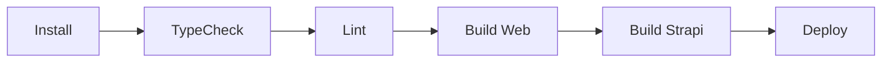
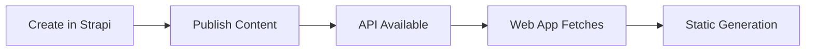

# Next Forge + Strapi Monorepo

**Production-grade Turborepo template with Next.js and Strapi**  
Version: 5.0.2  
Architecture: Refactored for dual-app structure

## 📋 Quick Reference

### Key Commands
```bash
# Development
pnpm dev                   # Start all apps in dev mode
pnpm dev:web              # Start web app only (port 3000)
pnpm dev:strapi           # Start Strapi CMS only (port 1337)

# Building & Testing
pnpm build                # Build all apps and packages
pnpm test                 # Run all tests (Vitest)
pnpm typecheck           # TypeScript checking across monorepo
pnpm analyze             # Bundle size analysis

# Code Quality
pnpm lint                 # Ultracite linting
pnpm format               # Code formatting

# Database & Dependencies
pnpm migrate              # Prisma schema + generate + push
pnpm bump-deps            # Update all dependencies
pnpm bump-ui              # Update shadcn/ui components
```

### Technology Stack
- **Frontend**: Next.js 15.3 + React 19 + TypeScript
- **CMS**: Strapi v5.16.0 (Headless CMS)
- **Styling**: Tailwind CSS v4
- **Database**: PostgreSQL + Prisma ORM  
- **Authentication**: Clerk (placeholder implementation)
- **Monorepo**: Turborepo + pnpm workspaces
- **Testing**: Vitest + React Testing Library
- **Observability**: Sentry
- **Code Quality**: Ultracite (Biome)
- **Internationalization**: next-international (6 languages)

## 🏗️ Architecture Overview

### Monorepo Structure (Refactored)
```
├── apps/                    # Deployable applications  
│   ├── web/                # Next.js app (marketing + auth app) - port 3000
│   └── strapi/             # Strapi CMS (admin + API) - port 1337
├── packages/               # Shared packages
│   ├── design-system/      # shadcn/ui components + Tailwind
│   ├── auth/               # Authentication (Clerk placeholder)
│   ├── strapi-client/      # Strapi SDK with caching & rate limiting
│   ├── internationalization/ # i18n support (6 languages)
│   ├── security/           # Security utilities (Arcjet removed)
│   ├── observability/      # Sentry + monitoring
│   ├── feature-flags/      # Feature toggles with Vercel toolbar
│   ├── notifications/      # Notification system
│   ├── email/              # Email templates
│   ├── payments/           # Payment processing
│   ├── storage/            # File storage utilities
│   ├── seo/                # SEO utilities
│   ├── rate-limit/         # Rate limiting middleware
│   ├── next-config/        # Shared Next.js configuration
│   └── typescript-config/  # Shared TypeScript configurations
└── docs/                   # Documentation files
```

## 📱 Applications

### Main Applications
| App | Port | Description | Key Features |
|-----|------|-------------|--------------|
| **web** | 3000 | Marketing website + App | i18n, blog, pricing, contact, authenticated app |
| **strapi** | 1337 | Headless CMS | Content management, API, media library |

### App Architecture Details

#### Web App (`apps/web/`)
- **Framework**: Next.js 15.3 with App Router
- **Features**: Marketing pages, blog, pricing, contact, authentication
- **Internationalization**: 6 languages (en, es, de, zh, fr, pt)
- **Content**: Fetches from Strapi CMS via `@repo/strapi-client`
- **Security**: Custom middleware (Arcjet removed)

#### Strapi CMS (`apps/strapi/`)  
- **Version**: Strapi v5.16.0 Community Edition
- **Database**: PostgreSQL with SQLite for development
- **Content Types**: Articles, Authors, Categories, Global settings
- **API**: RESTful and GraphQL endpoints
- **Admin Panel**: Full-featured content management interface

## 📦 Package Ecosystem

### Core Infrastructure
- **`@repo/strapi-client`** - Strapi SDK with caching, rate limiting, and React Server Components support
- **`@repo/auth`** - Authentication utilities (Clerk placeholder)
- **`@repo/security`** - Security middleware (Arcjet removed, nosecone for headers)
- **`@repo/observability`** - Sentry integration + error handling

### UI & Experience  
- **`@repo/design-system`** - shadcn/ui components + Tailwind CSS v4
- **`@repo/internationalization`** - i18n support with next-international (6 languages)
- **`@repo/seo`** - SEO utilities and metadata management
- **`@repo/feature-flags`** - Feature toggles with Vercel toolbar integration

### Features & Utilities
- **`@repo/notifications`** - Notification system components
- **`@repo/email`** - Email templates and utilities  
- **`@repo/payments`** - Payment processing utilities
- **`@repo/storage`** - File storage abstractions
- **`@repo/rate-limit`** - Rate limiting middleware

### Development Tools
- **`@repo/typescript-config`** - Shared TypeScript configurations
- **`@repo/next-config`** - Shared Next.js configurations and keys

## 🔧 Development Workflow

### Getting Started
1. **Prerequisites**: Node.js ≥18, pnpm v10.13.1
2. **Installation**: Clone repo and run `pnpm install`
3. **Development**: 
   - `pnpm dev` (starts both apps)
   - `pnpm dev:web` (web app only - port 3000)
   - `pnpm dev:strapi` (Strapi only - port 1337)
4. **Database**: Configure PostgreSQL for Strapi

### Key Patterns  
- **Workspace References**: All packages use `@repo/*` naming convention
- **Shared Configs**: TypeScript, Next.js, and Biome configs centralized
- **Environment Variables**: Type-safe env vars with `@t3-oss/env-nextjs`
- **CMS Integration**: Web app fetches content from Strapi via `@repo/strapi-client`
- **Internationalization**: Route-based i18n with middleware integration
- **Code Quality**: Ultracite (Biome) with strict TypeScript mode
- **Security**: Custom middleware without external security services

### Build Pipeline


### Content Workflow


## 📚 Documentation Structure

### API Documentation
- **Strapi API**: Auto-generated REST and GraphQL endpoints at `/api`
- **Web App**: Next.js API routes for custom endpoints
- **Strapi Client**: Full TypeScript SDK with caching and rate limiting

### Component Documentation
- **Design System**: `packages/design-system` with shadcn/ui components
- **Components**: Buttons, forms, layout, navigation, feedback components
- **Usage**: Import from `@repo/design-system`

### Content Management
- **Strapi Admin**: Full-featured CMS at `http://localhost:1337/admin`
- **Content Types**: Articles, Authors, Categories, Global settings
- **Media Library**: File upload and management system

## 🔐 Security & Compliance

### Authentication & Authorization
- **Web App**: Placeholder Clerk integration in auth package
- **Strapi**: Built-in user management and role-based permissions
- **Middleware**: Custom authentication middleware for web app
- **API Security**: Strapi API tokens and permissions

### Data Protection
- **Database**: PostgreSQL with type safety via Strapi schemas
- **Environment**: Secure environment variable handling with validation
- **Rate Limiting**: Custom rate limiting middleware (no external dependencies)
- **Security Headers**: Nosecone middleware for security headers

## 🚀 Deployment

### Deployment Architecture
- **Web App**: Vercel (optimized for Next.js with edge functions)
- **Strapi CMS**: Railway, Heroku, or VPS (Node.js hosting)
- **Database**: PostgreSQL on Railway, Supabase, or AWS RDS
- **Media Storage**: Strapi's built-in upload provider or cloud storage

### Configuration
- **Build Outputs**: Cached by Turborepo (includes `.strapi/` for CMS builds)
- **Environment**: Separate configs for web app and Strapi
- **Monitoring**: Sentry integration for error tracking across both apps

## 📊 Performance & Monitoring

### Build Performance
- **Turborepo**: Intelligent caching and task orchestration for both apps
- **Turbopack**: Fast development builds for Next.js web app
- **Bundle Analysis**: Built-in bundle size analysis for web app
- **Strapi**: Optimized builds with TypeScript compilation

### Runtime Monitoring
- **Observability**: Sentry error tracking for both apps
- **CMS Performance**: Strapi built-in performance monitoring
- **Caching**: Strapi client SDK with intelligent caching and rate limiting
- **Health Checks**: Both apps provide health monitoring endpoints

## 🤝 Contributing

### Code Standards
- **Linting**: Ultracite (Biome) with strict rules
- **TypeScript**: Strict mode enabled
- **Testing**: Minimum test coverage requirements
- **Git**: Conventional commits

### Development Process
1. Fork repository
2. Create feature branch
3. Run tests: `pnpm test`
4. Run linting: `pnpm lint`
5. Submit PR with clear description

## 📈 Project Metrics

### Repository Stats (Post-Refactoring)
- **Applications**: 2 main apps (web + strapi)
- **Packages**: 15 focused shared packages
- **Dependencies**: Reduced redundancy, modern stack
- **Architecture**: Simplified dual-app structure
- **Build Time**: Optimized with Turborepo caching and parallel builds

### Community
- **License**: MIT
- **Documentation**: Comprehensive guides and API docs
- **Support**: GitHub issues and discussions
- **Updates**: Regular dependency updates and security patches

## 🔄 Recent Refactoring Changes

### What Changed
- **Simplified Architecture**: Reduced from 8 apps to 2 main applications
- **Removed Dependencies**: Eliminated Arcjet, unused analytics packages, missing CMS references
- **Enhanced Strapi Integration**: Created comprehensive `@repo/strapi-client` SDK
- **Improved Monorepo**: Updated Turborepo configuration for dual-app structure
- **Fixed Import Issues**: Resolved missing package references and TypeScript errors

### Benefits
- **Reduced Complexity**: Cleaner architecture with focused applications
- **Better Performance**: Fewer dependencies and optimized builds
- **Enhanced Integration**: Seamless content flow from Strapi to web app
- **Improved DX**: Individual app development with `pnpm dev:web` and `pnpm dev:strapi`

---

*Last updated: August 2025*  
*Architecture refactored for dual-app structure with Next.js + Strapi*