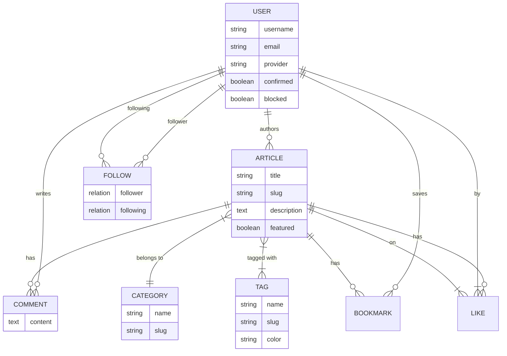

# Entity Reference

Complete data model documentation for the StrapiPress social blogging platform. This document covers all content types, components, and their relationships.

---

## Entity Overview

| Type | Name | Description | Draft/Publish |
|------|------|-------------|---------------|
| Collection | Article | Blog posts with rich content | Yes |
| Collection | Category | Article categorization | No |
| Collection | Tag | Article tagging system | No |
| Collection | Comment | User comments on articles | No |
| Collection | Like | Article likes | No |
| Collection | Bookmark | Saved articles | No |
| Collection | Follow | User following relationships | No |
| Single | About | About page content | No |
| Single | Global | Site-wide settings | No |
| Single | Footer | Footer configuration | No |
| Plugin | User | User accounts (users-permissions) | N/A |

---

## Entity Relationship Diagram



---

## Collection Types

### Article

The core content type for blog posts with rich content blocks and social features.

**API Identifier**: `api::article.article`

**Schema Location**: `apps/strapi/src/api/article/content-types/article/schema.json`

| Field | Type | Required | Description |
|-------|------|----------|-------------|
| `title` | string | No | Article title |
| `description` | text | No | Short description (max 150 chars) |
| `slug` | uid | No | URL-friendly identifier (auto from title) |
| `cover` | media | No | Cover image/video |
| `author` | relation | No | Author (User) - manyToOne |
| `category` | relation | No | Category - manyToOne |
| `tags` | relation | No | Tags - manyToMany |
| `blocks` | dynamiczone | No | Content blocks (Media, Quote, Rich Text, Slider) |
| `featured` | boolean | No | Featured article flag (default: false) |
| `comments` | relation | No | Comments - oneToMany |
| `likes` | relation | No | Likes - oneToMany |
| `bookmarks` | relation | No | Bookmarks - oneToMany |
| `likesCount` | integer | No | Cached likes count (default: 0) |
| `commentsCount` | integer | No | Cached comments count (default: 0) |
| `bookmarksCount` | integer | No | Cached bookmarks count (default: 0) |

**Features**:
- Draft and Publish enabled
- Dynamic zone for flexible content blocks
- Denormalized counts for performance

**Example Response**:
```json
{
  "id": 1,
  "documentId": "abc123",
  "title": "Getting Started with React",
  "slug": "getting-started-with-react",
  "description": "A beginner's guide to React",
  "featured": true,
  "likesCount": 42,
  "commentsCount": 5,
  "bookmarksCount": 12,
  "createdAt": "2024-01-15T10:00:00.000Z",
  "publishedAt": "2024-01-15T10:00:00.000Z",
  "author": { "id": 1, "username": "johndoe" },
  "category": { "id": 1, "name": "Technology", "slug": "tech" },
  "tags": [{ "id": 1, "name": "React", "slug": "react" }],
  "blocks": [
    { "__component": "shared.rich-text", "body": "<p>Content...</p>" }
  ]
}
```

---

### Category

Organize articles into categories for content organization and navigation.

**API Identifier**: `api::category.category`

**Schema Location**: `apps/strapi/src/api/category/content-types/category/schema.json`

| Field | Type | Required | Description |
|-------|------|----------|-------------|
| `name` | string | No | Category name |
| `slug` | uid | No | URL-friendly identifier |
| `description` | text | No | Category description |
| `image` | media | No | Category image (images only) |
| `articles` | relation | No | Articles in category - oneToMany |

**Features**:
- No draft/publish (always published)
- Direct relationship to articles

**Example Response**:
```json
{
  "id": 1,
  "documentId": "cat123",
  "name": "Technology",
  "slug": "technology",
  "description": "Tech articles and tutorials",
  "image": {
    "url": "/uploads/tech_category.jpg"
  }
}
```

---

### Tag

Flexible tagging system for cross-cutting article organization.

**API Identifier**: `api::tag.tag`

**Schema Location**: `apps/strapi/src/api/tag/content-types/tag/schema.json`

| Field | Type | Required | Validation | Description |
|-------|------|----------|------------|-------------|
| `name` | string | Yes | unique, 1-30 chars | Tag name |
| `slug` | uid | Yes | - | URL-friendly identifier (auto from name) |
| `description` | text | No | - | Tag description |
| `color` | string | No | regex: `^#[0-9A-Fa-f]{6}$` | Hex color code |
| `articles` | relation | No | - | Tagged articles - manyToMany |
| `usageCount` | integer | No | - | Cached usage count (default: 0) |

**Features**:
- Unique tag names (case-sensitive in schema)
- Color for UI display
- Usage count for popularity sorting

**Example Response**:
```json
{
  "id": 1,
  "documentId": "tag123",
  "name": "React",
  "slug": "react",
  "description": "React.js articles and tutorials",
  "color": "#3b82f6",
  "usageCount": 25
}
```

---

### Comment

User comments on articles for engagement and discussion.

**API Identifier**: `api::comment.comment`

**Schema Location**: `apps/strapi/src/api/comment/content-types/comment/schema.json`

| Field | Type | Required | Description |
|-------|------|----------|-------------|
| `content` | text | Yes | Comment content |
| `user` | relation | No | Comment author (User) - manyToOne |
| `article` | relation | No | Commented article - manyToOne |

**Features**:
- Simple flat comment structure (no threading)
- Links user to their comments

**Example Response**:
```json
{
  "id": 1,
  "documentId": "com123",
  "content": "Great article! Very helpful.",
  "createdAt": "2024-01-15T12:00:00.000Z",
  "user": {
    "id": 2,
    "username": "janedoe"
  },
  "article": {
    "id": 5,
    "title": "Getting Started with React"
  }
}
```

---

### Like

Article like/favorite system for social engagement.

**API Identifier**: `api::like.like`

**Schema Location**: `apps/strapi/src/api/like/content-types/like/schema.json`

| Field | Type | Required | Description |
|-------|------|----------|-------------|
| `user` | relation | No | User who liked - manyToOne |
| `article` | relation | No | Liked article - manyToOne |

**Features**:
- Simple junction entity for user-article likes
- Should enforce unique constraint at application level

**Example Response**:
```json
{
  "id": 1,
  "documentId": "like123",
  "createdAt": "2024-01-15T10:30:00.000Z",
  "user": { "id": 1 },
  "article": { "id": 5 }
}
```

---

### Bookmark

Saved articles/reading list functionality.

**API Identifier**: `api::bookmark.bookmark`

**Schema Location**: `apps/strapi/src/api/bookmark/content-types/bookmark/schema.json`

| Field | Type | Required | Description |
|-------|------|----------|-------------|
| `user` | relation | No | User who bookmarked - manyToOne |
| `article` | relation | No | Bookmarked article - manyToOne |

**Features**:
- Simple junction entity for user-article bookmarks
- Allows users to save articles for later reading

**Example Response**:
```json
{
  "id": 1,
  "documentId": "bm123",
  "createdAt": "2024-01-15T10:00:00.000Z",
  "user": { "id": 1 },
  "article": {
    "id": 5,
    "title": "Bookmarked Article",
    "slug": "bookmarked-article"
  }
}
```

---

### Follow

User following/follower relationships for social networking.

**API Identifier**: `api::follow.follow`

**Schema Location**: `apps/strapi/src/api/follow/content-types/follow/schema.json`

| Field | Type | Required | Description |
|-------|------|----------|-------------|
| `follower` | relation | No | User who follows - manyToOne |
| `following` | relation | No | User being followed - manyToOne |

**Features**:
- Self-referential user relationship
- Enables social feed and notifications

**Example Response**:
```json
{
  "id": 1,
  "documentId": "fol123",
  "createdAt": "2024-01-10T08:00:00.000Z",
  "follower": {
    "id": 1,
    "username": "johndoe"
  },
  "following": {
    "id": 5,
    "username": "popularuser"
  }
}
```

---

## Single Types (Singletons)

### About

About page content with flexible blocks.

**API Identifier**: `api::about.about`

**Schema Location**: `apps/strapi/src/api/about/content-types/about/schema.json`

| Field | Type | Required | Description |
|-------|------|----------|-------------|
| `title` | text | No | Page title |
| `blocks` | dynamiczone | No | Content blocks (Media, Quote, Rich Text, Slider) |

**Features**:
- Single instance (singleton)
- Dynamic zone for flexible content layout

**Example Response**:
```json
{
  "data": {
    "title": "About StrapiPress",
    "blocks": [
      {
        "__component": "shared.rich-text",
        "body": "<h2>Our Story</h2><p>StrapiPress is...</p>"
      },
      {
        "__component": "shared.media",
        "file": { "url": "/uploads/team_photo.jpg" }
      }
    ]
  }
}
```

---

### Global

Site-wide settings and default SEO configuration.

**API Identifier**: `api::global.global`

**Schema Location**: `apps/strapi/src/api/global/content-types/global/schema.json`

| Field | Type | Required | Description |
|-------|------|----------|-------------|
| `siteName` | string | Yes | Site name |
| `siteDescription` | text | Yes | Site description |
| `favicon` | media | No | Site favicon |
| `defaultSeo` | component | No | Default SEO settings (shared.seo) |

**Features**:
- Single instance (singleton)
- Central configuration for site metadata

**Example Response**:
```json
{
  "data": {
    "siteName": "StrapiPress",
    "siteDescription": "A modern social blogging platform",
    "favicon": { "url": "/uploads/favicon.ico" },
    "defaultSeo": {
      "metaTitle": "StrapiPress - Social Blogging",
      "metaDescription": "Share your stories with the world",
      "shareImage": { "url": "/uploads/og_image.jpg" }
    }
  }
}
```

---

### Footer

Footer configuration with navigation columns and social links.

**API Identifier**: `api::footer.footer`

**Schema Location**: `apps/strapi/src/api/footer/content-types/footer/schema.json`

| Field | Type | Required | Description |
|-------|------|----------|-------------|
| `columns` | component[] | No | Navigation columns (max 4) |
| `socialLinks` | component[] | No | Social media links |
| `copyright` | text | No | Copyright text |
| `bottomLinks` | component[] | No | Bottom footer links |

**Features**:
- Single instance (singleton)
- Internationalization (i18n) enabled
- Nested components for flexible structure

**Example Response**:
```json
{
  "data": {
    "columns": [
      {
        "title": "Company",
        "links": [
          { "label": "About", "url": "/about", "isExternal": false }
        ]
      }
    ],
    "socialLinks": [
      { "platform": "twitter", "url": "https://twitter.com/strapipress", "label": "Twitter" }
    ],
    "copyright": "© 2024 StrapiPress. All rights reserved.",
    "bottomLinks": [
      { "label": "Privacy Policy", "url": "/privacy", "isExternal": false }
    ]
  }
}
```

---

## User Entity (users-permissions)

The User entity is provided by Strapi's users-permissions plugin and extended with custom relations.

**API Identifier**: `plugin::users-permissions.user`

### Default Fields

| Field | Type | Required | Description |
|-------|------|----------|-------------|
| `username` | string | Yes | Unique username |
| `email` | string | Yes | Unique email address |
| `password` | string | Yes | Hashed password |
| `provider` | string | No | Auth provider (local, google, etc.) |
| `confirmed` | boolean | No | Email confirmed status |
| `blocked` | boolean | No | Account blocked status |
| `role` | relation | No | User role |

### Extended Relations

| Relation | Type | Description |
|----------|------|-------------|
| `articles` | oneToMany | Articles authored by user |
| `comments` | oneToMany | Comments made by user |
| `likes` | oneToMany | Articles liked by user |
| `bookmarks` | oneToMany | Articles bookmarked by user |
| `following` | oneToMany | Users this user follows (via Follow) |
| `followers` | oneToMany | Users following this user (via Follow) |

**Example Response**:
```json
{
  "id": 1,
  "username": "johndoe",
  "email": "john@example.com",
  "provider": "local",
  "confirmed": true,
  "blocked": false,
  "createdAt": "2024-01-01T00:00:00.000Z"
}
```

---

## Components

### Shared Components

#### shared.media

Single media file attachment.

| Field | Type | Description |
|-------|------|-------------|
| `file` | media | Single image, file, or video |

#### shared.rich-text

Rich text content block.

| Field | Type | Description |
|-------|------|-------------|
| `body` | richtext | HTML/Markdown content |

#### shared.quote

Quotation block with title and body.

| Field | Type | Description |
|-------|------|-------------|
| `title` | string | Quote attribution/title |
| `body` | text | Quote content |

#### shared.seo

SEO metadata component.

| Field | Type | Required | Description |
|-------|------|----------|-------------|
| `metaTitle` | string | Yes | Page title for SEO |
| `metaDescription` | text | Yes | Page description for SEO |
| `shareImage` | media | No | Open Graph image |

#### shared.slider

Image gallery/slider component.

| Field | Type | Description |
|-------|------|-------------|
| `files` | media[] | Multiple images for slider |

---

### Footer Components

#### footer.navigation-column

Navigation column with title and links.

| Field | Type | Required | Description |
|-------|------|----------|-------------|
| `title` | string | Yes | Column title |
| `links` | component[] | No | Navigation links |

#### footer.navigation-link

Single navigation link.

| Field | Type | Required | Default | Description |
|-------|------|----------|---------|-------------|
| `label` | string | Yes | - | Link text |
| `url` | string | Yes | - | Link URL |
| `isExternal` | boolean | No | false | External link flag |
| `openInNewTab` | boolean | No | false | Open in new tab |

#### footer.social-link

Social media link with platform icon.

| Field | Type | Required | Description |
|-------|------|----------|-------------|
| `platform` | enum | Yes | Platform identifier |
| `url` | string | Yes | Social profile URL |
| `label` | string | No | Accessibility label |

**Platform Options**:
`facebook`, `twitter`, `x`, `instagram`, `linkedin`, `youtube`, `github`, `discord`, `telegram`, `tiktok`

---

## Relationship Summary

### User Relationships

| From | To | Type | Description |
|------|-----|------|-------------|
| User | Article | 1:N | Author of articles |
| User | Comment | 1:N | Author of comments |
| User | Like | 1:N | User's likes |
| User | Bookmark | 1:N | User's bookmarks |
| User | Follow (follower) | 1:N | Users being followed |
| User | Follow (following) | 1:N | Users following this user |

### Article Relationships

| From | To | Type | Description |
|------|-----|------|-------------|
| Article | User | N:1 | Article author |
| Article | Category | N:1 | Article category |
| Article | Tag | N:M | Article tags |
| Article | Comment | 1:N | Article comments |
| Article | Like | 1:N | Article likes |
| Article | Bookmark | 1:N | Article bookmarks |

### Category & Tag Relationships

| From | To | Type | Description |
|------|-----|------|-------------|
| Category | Article | 1:N | Articles in category |
| Tag | Article | N:M | Tagged articles |

---

## Database Indexes

### Auto-Generated Indexes

Strapi automatically creates indexes for:
- Primary keys (`id`)
- Unique fields (`slug`, `email`, `username`)
- Foreign keys (all relation fields)

### Recommended Additional Indexes

For optimal query performance, consider adding:

```sql
-- Article queries
CREATE INDEX idx_articles_featured ON articles(featured);
CREATE INDEX idx_articles_created_at ON articles(created_at DESC);
CREATE INDEX idx_articles_published_at ON articles(published_at DESC);

-- Tag queries
CREATE INDEX idx_tags_usage_count ON tags(usage_count DESC);

-- Social feature queries
CREATE INDEX idx_likes_user_article ON likes(user_id, article_id);
CREATE INDEX idx_bookmarks_user_article ON bookmarks(user_id, article_id);
CREATE INDEX idx_follows_follower_following ON follows(follower_id, following_id);
CREATE INDEX idx_comments_article ON comments(article_id, created_at DESC);
```

---

## Entity Counts Summary

| Category | Count |
|----------|-------|
| Collection Types | 7 |
| Single Types | 3 |
| Shared Components | 5 |
| Footer Components | 3 |
| **Total Entities** | **18** |

