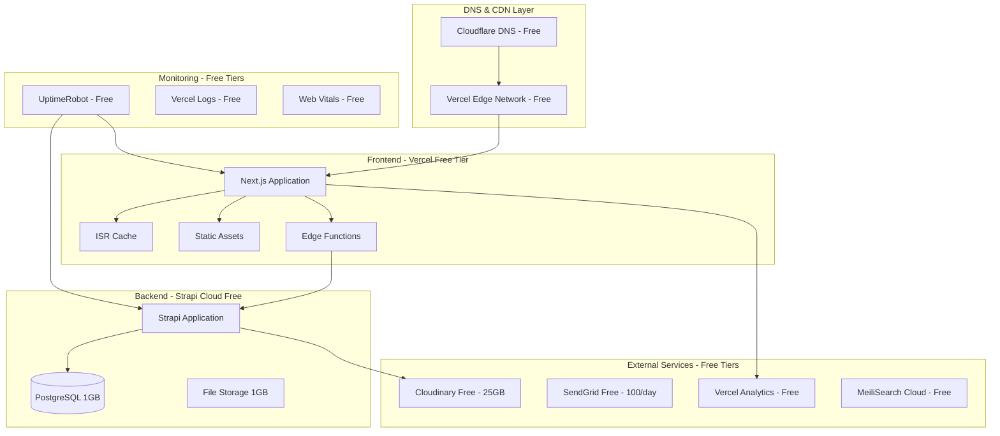

# Free Tier Deployment Architecture

## 🏗️ Infrastructure Overview



## 🎯 Service Configuration

### Vercel Frontend Deployment

```yaml
# vercel.json
{
  "version": 2,
  "buildCommand": "pnpm build --filter=web",
  "outputDirectory": "apps/web/.next",
  "installCommand": "pnpm install --frozen-lockfile",
  "framework": "nextjs",
  "regions": ["iad1", "sfo1"],
  "functions": {
    "apps/web/app/api/**/*.ts": {
      "maxDuration": 10
    }
  },
  "headers": [
    {
      "source": "/(.*)",
      "headers": [
        {
          "key": "X-Content-Type-Options",
          "value": "nosniff"
        },
        {
          "key": "X-Frame-Options", 
          "value": "DENY"
        },
        {
          "key": "Referrer-Policy",
          "value": "strict-origin-when-cross-origin"
        }
      ]
    },
    {
      "source": "/api/(.*)",
      "headers": [
        {
          "key": "Cache-Control",
          "value": "s-maxage=300, stale-while-revalidate=60"
        }
      ]
    },
    {
      "source": "/(.*\\.(ico|png|jpg|jpeg|webp|svg|css|js))",
      "headers": [
        {
          "key": "Cache-Control",
          "value": "public, max-age=31536000, immutable"
        }
      ]
    }
  ],
  "rewrites": [
    {
      "source": "/sitemap.xml",
      "destination": "/api/sitemap"
    },
    {
      "source": "/robots.txt", 
      "destination": "/api/robots"
    }
  ],
  "env": {
    "NEXT_PUBLIC_STRAPI_URL": "@strapi_url",
    "NEXT_PUBLIC_SITE_URL": "@site_url",
    "STRAPI_API_TOKEN": "@strapi_token",
    "CLOUDINARY_CLOUD_NAME": "@cloudinary_name",
    "CLOUDINARY_API_KEY": "@cloudinary_key",
    "CLOUDINARY_API_SECRET": "@cloudinary_secret"
  }
}
```

### Strapi Cloud Configuration

```javascript
// config/database.ts - Optimized for free tier
export default ({ env }) => ({
  connection: {
    client: 'postgres',
    connection: {
      connectionString: env('DATABASE_URL'),
      ssl: {
        rejectUnauthorized: false
      }
    },
    pool: {
      min: 0,
      max: 3, // Limited for free tier
      acquireTimeoutMillis: 30000,
      createTimeoutMillis: 30000,
      destroyTimeoutMillis: 5000,
      idleTimeoutMillis: 30000,
    },
    debug: false,
  },
});

// config/plugins.ts - Free tier services
export default ({ env }) => ({
  upload: {
    config: {
      provider: 'cloudinary',
      providerOptions: {
        cloud_name: env('CLOUDINARY_NAME'),
        api_key: env('CLOUDINARY_KEY'),
        api_secret: env('CLOUDINARY_SECRET'),
      },
      actionOptions: {
        upload: {
          resource_type: "auto",
          quality: "auto:best",
          format: "auto",
          transformation: [
            { width: 1200, height: 630, crop: "limit", quality: "auto:best" },
          ],
        },
        uploadStream: {
          resource_type: "auto", 
          quality: "auto:best",
          format: "auto",
        },
      },
    },
  },
  
  email: {
    config: {
      provider: 'sendgrid',
      providerOptions: {
        apiKey: env('SENDGRID_API_KEY'),
      },
      settings: {
        defaultFrom: env('EMAIL_FROM', 'noreply@yournewssite.com'),
        defaultReplyTo: env('EMAIL_REPLY_TO', 'hello@yournewssite.com'),
      },
    },
  },

  'users-permissions': {
    config: {
      jwt: {
        expiresIn: '7d',
      },
      providers: {
        google: {
          enabled: false, // Enable when ready
        },
        github: {
          enabled: false, // Enable when ready
        }
      }
    },
  },

  // Rate limiting for API protection
  'rate-limit': {
    enabled: true,
    config: {
      interval: 60000, // 1 minute
      max: 100, // requests per interval
      delayAfter: 50,
      delayMs: 500,
      skipSuccessfulRequests: false,
      skipFailedRequests: false,
    },
  },
});

// config/middlewares.ts
export default [
  'strapi::logger',
  'strapi::errors',
  {
    name: 'strapi::security',
    config: {
      contentSecurityPolicy: {
        useDefaults: true,
        directives: {
          'connect-src': ["'self'", 'https:'],
          'img-src': [
            "'self'",
            'data:',
            'blob:',
            'res.cloudinary.com',
            'images.unsplash.com',
          ],
          'media-src': ["'self'", 'data:', 'blob:', 'res.cloudinary.com'],
          upgradeInsecureRequests: null,
        },
      },
    },
  },
  'strapi::cors',
  'strapi::poweredBy',
  'strapi::query',
  {
    name: 'strapi::body',
    config: {
      jsonLimit: '2mb', // Reduced for free tier
      formLimit: '2mb',
      textLimit: '2mb',
    },
  },
  'strapi::session',
  'strapi::favicon',
  'strapi::public',
];
```

## 📊 Resource Monitoring & Optimization

### Database Size Monitoring

```javascript
// scripts/monitor-database.js
const strapi = require('@strapi/strapi');

async function monitorDatabaseSize() {
  const knex = strapi.db.connection;
  
  // Get table sizes
  const tableSizes = await knex.raw(`
    SELECT 
      schemaname,
      tablename,
      pg_size_pretty(pg_total_relation_size(schemaname||'.'||tablename)) as size,
      pg_total_relation_size(schemaname||'.'||tablename) as bytes
    FROM pg_tables 
    WHERE schemaname = 'public'
    ORDER BY pg_total_relation_size(schemaname||'.'||tablename) DESC;
  `);
  
  // Check total database size
  const totalSize = await knex.raw(`
    SELECT pg_size_pretty(pg_database_size(current_database())) as size;
  `);
  
  console.log('=== Database Size Report ===');
  console.log('Total size:', totalSize.rows[0].size);
  console.log('\nTable sizes:');
  tableSizes.rows.forEach(row => {
    console.log(`${row.tablename}: ${row.size}`);
  });
  
  // Warning if approaching limits
  const totalBytes = tableSizes.rows.reduce((sum, row) => sum + parseInt(row.bytes), 0);
  const limitBytes = 1024 * 1024 * 1024; // 1GB
  const percentage = (totalBytes / limitBytes) * 100;
  
  if (percentage > 80) {
    console.warn(`⚠️  Database is ${percentage.toFixed(1)}% full. Consider archiving old content.`);
  }
  
  return {
    totalSize: totalSize.rows[0].size,
    percentage,
    tables: tableSizes.rows,
  };
}

// Run monitoring
monitorDatabaseSize().catch(console.error);
```

### API Usage Tracking

```javascript
// middleware/api-usage-tracker.js
module.exports = (config, { strapi }) => {
  return async (ctx, next) => {
    const startTime = Date.now();
    
    await next();
    
    const duration = Date.now() - startTime;
    
    // Log API usage
    strapi.log.info(`API Call: ${ctx.method} ${ctx.url} - ${ctx.status} - ${duration}ms`);
    
    // Track usage in database or external service
    await strapi.service('api::usage.usage').track({
      method: ctx.method,
      endpoint: ctx.url,
      status: ctx.status,
      duration,
      timestamp: new Date(),
    });
  };
};
```

## 🔄 Content Lifecycle Management

### Automated Content Archiving

```javascript
// scripts/archive-old-content.js
const fs = require('fs');
const path = require('path');

async function archiveOldContent() {
  const strapi = require('@strapi/strapi');
  await strapi.load();
  
  const sixMonthsAgo = new Date();
  sixMonthsAgo.setMonth(sixMonthsAgo.getMonth() - 6);
  
  // Find old articles
  const oldArticles = await strapi.entityService.findMany('api::article.article', {
    filters: {
      publishedAt: { $lt: sixMonthsAgo.toISOString() },
      status: 'published'
    },
    populate: ['author', 'categories', 'tags', 'featuredImage'],
  });
  
  if (oldArticles.length === 0) {
    console.log('No articles to archive');
    return;
  }
  
  // Export to JSON archive
  const archive = {
    exportDate: new Date().toISOString(),
    articleCount: oldArticles.length,
    articles: oldArticles,
  };
  
  const archiveFileName = `archive-${new Date().toISOString().split('T')[0]}.json`;
  const archivePath = path.join(__dirname, '..', 'archives', archiveFileName);
  
  // Ensure directory exists
  const archiveDir = path.dirname(archivePath);
  if (!fs.existsSync(archiveDir)) {
    fs.mkdirSync(archiveDir, { recursive: true });
  }
  
  // Write archive file
  fs.writeFileSync(archivePath, JSON.stringify(archive, null, 2));
  
  // Update articles to archived status
  const articleIds = oldArticles.map(article => article.id);
  await Promise.all(
    articleIds.map(id =>
      strapi.entityService.update('api::article.article', id, {
        data: { status: 'archived' }
      })
    )
  );
  
  console.log(`✅ Archived ${oldArticles.length} articles to ${archiveFileName}`);
  
  // Optional: Remove from database after archiving
  // await Promise.all(
  //   articleIds.map(id => 
  //     strapi.entityService.delete('api::article.article', id)
  //   )
  // );
}

module.exports = archiveOldContent;
```

### Image Optimization Script

```javascript
// scripts/optimize-images.js
const cloudinary = require('cloudinary').v2;

async function optimizeImages() {
  cloudinary.config({
    cloud_name: process.env.CLOUDINARY_NAME,
    api_key: process.env.CLOUDINARY_KEY,
    api_secret: process.env.CLOUDINARY_SECRET,
  });
  
  // Get all uploaded images older than 30 days
  const thirtyDaysAgo = new Date();
  thirtyDaysAgo.setDate(thirtyDaysAgo.getDate() - 30);
  
  const result = await cloudinary.search
    .expression(`created_at<${thirtyDaysAgo.toISOString().split('T')[0]} AND resource_type:image`)
    .max_results(500)
    .execute();
  
  console.log(`Found ${result.resources.length} images to optimize`);
  
  // Optimize each image
  for (const resource of result.resources) {
    try {
      await cloudinary.uploader.upload(resource.secure_url, {
        public_id: resource.public_id,
        overwrite: true,
        quality: "auto:best",
        format: "auto",
        flags: "progressive",
      });
      
      console.log(`✅ Optimized: ${resource.public_id}`);
    } catch (error) {
      console.error(`❌ Failed to optimize ${resource.public_id}:`, error.message);
    }
  }
}

module.exports = optimizeImages;
```

## 📈 Performance Monitoring

### Core Web Vitals Tracking

```typescript
// lib/web-vitals.ts
import { getCLS, getFID, getFCP, getLCP, getTTFB } from 'web-vitals';

export function trackWebVitals() {
  function sendToAnalytics(metric: any) {
    // Send to Vercel Analytics
    if (typeof window !== 'undefined' && (window as any).va) {
      (window as any).va('track', 'web-vital', {
        name: metric.name,
        value: metric.value,
        delta: metric.delta,
        id: metric.id,
      });
    }
    
    // Also log to console in development
    if (process.env.NODE_ENV === 'development') {
      console.log('Web Vital:', metric);
    }
  }
  
  getCLS(sendToAnalytics);
  getFID(sendToAnalytics);
  getFCP(sendToAnalytics);
  getLCP(sendToAnalytics);
  getTTFB(sendToAnalytics);
}
```

### Uptime Monitoring

```yaml
# .github/workflows/uptime-check.yml
name: Uptime Check
on:
  schedule:
    - cron: '*/5 * * * *' # Every 5 minutes
  workflow_dispatch:

jobs:
  uptime:
    runs-on: ubuntu-latest
    steps:
      - name: Check Frontend
        run: |
          response=$(curl -s -o /dev/null -w "%{http_code}" ${{ secrets.FRONTEND_URL }})
          if [ $response -ne 200 ]; then
            echo "Frontend is down: HTTP $response"
            exit 1
          fi
          
      - name: Check Backend API
        run: |
          response=$(curl -s -o /dev/null -w "%{http_code}" ${{ secrets.STRAPI_URL }}/api/articles)
          if [ $response -ne 200 ]; then
            echo "Backend API is down: HTTP $response"
            exit 1
          fi
          
      - name: Notify on Failure
        if: failure()
        uses: 8398a7/action-slack@v3
        with:
          status: failure
          text: 'Site is down! Please check immediately.'
        env:
          SLACK_WEBHOOK_URL: ${{ secrets.SLACK_WEBHOOK }}
```

## 🚀 Deployment Automation

### GitHub Actions Workflow

```yaml
# .github/workflows/deploy.yml
name: Deploy to Production

on:
  push:
    branches: [main]
  pull_request:
    branches: [main]

jobs:
  test:
    runs-on: ubuntu-latest
    steps:
      - uses: actions/checkout@v4
      - uses: pnpm/action-setup@v2
        with:
          version: 8
      - uses: actions/setup-node@v4
        with:
          node-version: '18'
          cache: 'pnpm'
          
      - name: Install dependencies
        run: pnpm install --frozen-lockfile
        
      - name: Run tests
        run: pnpm test
        
      - name: Build frontend
        run: pnpm build --filter=web
        
      - name: Check bundle size
        run: pnpm analyze --filter=web

  deploy-frontend:
    needs: test
    runs-on: ubuntu-latest
    if: github.ref == 'refs/heads/main'
    steps:
      - uses: actions/checkout@v4
      - name: Deploy to Vercel
        uses: amondnet/vercel-action@v25
        with:
          vercel-token: ${{ secrets.VERCEL_TOKEN }}
          vercel-org-id: ${{ secrets.ORG_ID }}
          vercel-project-id: ${{ secrets.PROJECT_ID }}
          working-directory: ./apps/web
          vercel-args: '--prod'

  deploy-backend:
    needs: test
    runs-on: ubuntu-latest
    if: github.ref == 'refs/heads/main'
    steps:
      - uses: actions/checkout@v4
      - name: Deploy to Strapi Cloud
        run: |
          # Strapi Cloud auto-deploys from GitHub
          echo "Backend deployment handled by Strapi Cloud"
```

## 💰 Cost Monitoring

### Free Tier Usage Dashboard

```typescript
// pages/api/admin/usage.ts
export default async function handler(req: NextApiRequest, res: NextApiResponse) {
  if (req.method !== 'GET') {
    return res.status(405).json({ error: 'Method not allowed' });
  }
  
  // Check authentication
  const token = req.headers.authorization?.replace('Bearer ', '');
  if (token !== process.env.ADMIN_TOKEN) {
    return res.status(401).json({ error: 'Unauthorized' });
  }
  
  try {
    const usage = {
      vercel: {
        bandwidth: await getVercelBandwidth(),
        functions: await getVercelFunctions(),
        builds: await getVercelBuilds(),
        limits: {
          bandwidth: '100GB',
          functions: '100GB-hours',
          builds: '6000 minutes',
        },
      },
      strapi: {
        database: await getStrapiDatabaseUsage(),
        api_calls: await getStrapiApiCalls(),
        storage: await getStrapiStorageUsage(),
        limits: {
          database: '1GB',
          api_calls: '1M/month',
          storage: '1GB',
        },
      },
      cloudinary: {
        storage: await getCloudinaryStorage(),
        bandwidth: await getCloudinaryBandwidth(),
        transformations: await getCloudinaryTransformations(),
        limits: {
          storage: '25GB',
          bandwidth: '25GB/month',
          transformations: '25K/month',
        },
      },
    };
    
    res.json(usage);
  } catch (error) {
    console.error('Usage check failed:', error);
    res.status(500).json({ error: 'Failed to fetch usage data' });
  }
}
```

This deployment architecture ensures:
- ✅ **Zero hosting costs** for the first 6-12 months
- ✅ **Scalable foundation** that grows with your site
- ✅ **Production-ready** performance and monitoring
- ✅ **WordPress-competitive** features within free limits
- ✅ **Automated deployments** and content management